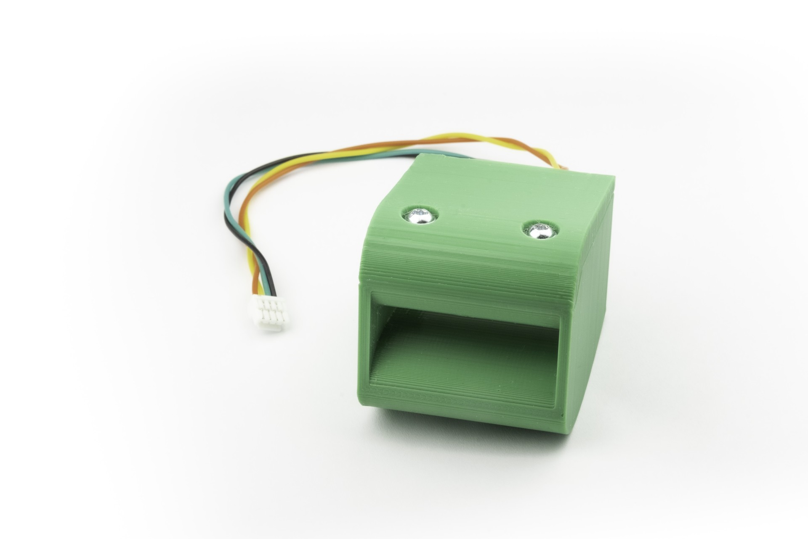

# TFSLOT01A - Low-speed airspeed sensor for UAVs



[TFSLOT](https://github.com/ThunderFly-aerospace/TFSLOT01) sensor is an airspeed sensor designed to be used on UAVs to measure [IAS](https://en.wikipedia.org/wiki/Indicated_airspeed). Due to the 3D printed case, it is possible to optimize the characteristics according to the location of the sensor on the UAV and specific application requirements on measuring range. The first use of this sensor is on ThunderFly autogyro [TF-G2](https://github.com/ThunderFly-aerospace/TF-G2/).

## Main Features

  * Improved low-speed resolution compared to traditional pitot tubes.
  * Reduced tendency for clogging due to the absence of a stagnation point.
  * Directly integrated differential pressure sensor, eliminating the need for additional tubing.
  * Customizable 3D-printed case to fit specific applications.
  * Integrated IMU to vibration diagnostics on AoA measurement. 

TFSLOT is commercially available from [ThunderFly s.r.o.](https://www.thunderfly.cz/), write an email to info@thunderfly.cz or shop at [Tindie store](https://www.tindie.com/products/thunderfly/tfslot01a-drone-indicated-airspeed-sensor/).

## Technical Parameters

| Parameter | Value | Description |
|-----------|-------|-------------|
| Airspeed measurement range | 0 - 48 m/s | Assumes air density 1.29 kg/m³ |
| I2C Connector | 2x 4-pin JST-GH | [Pixhawk connector standard](https://github.com/pixhawk/Pixhawk-Standards/blob/master/DS-009%20Pixhawk%20Connector%20Standard.pdf) |
| RPM connector | 3-pin 2.54mm pitch header | Internal 22k Ohm pullup resistor |
| I2C address | 0x21 SDP3x sensor, 0x68 IMU | SDP3x sensor is visible only after proper init of IMUKdy  |
| I2C SCL clock frequency | Typ. 400 kHz | Operation above 400 kHz is possible, but unreliable|
| Operating and storage temperature | −20°C to +40°C | Limited by case material |
| Operational input voltage | +3.6V to +5.4V | Overvoltage internally protected by Zener diode, Undervoltage is not treated |
| Mass | 14g | Printed case gcode included in docs |
| Dimensions | 23.5x42x12.5mm | Default 3D printed Case |
| Weather resistance | [IP42](https://en.wikipedia.org/wiki/IP_Code) | External connectors fully occupied |

The TFSLOT uses the [TFASPDIMU02 electronics](https://github.com/ThunderFly-aerospace/TFASPDIMU02) which has many more options for how can be used, please look at its documentation for more details and parameters. 

## Connection to the Pixhawk-based autopilots

The I²C interface connectors respect the [Pixhawk connector standard](https://github.com/pixhawk/Pixhawk-Standards/blob/master/DS-009%20Pixhawk%20Connector%20Standard.pdf). The signal and color coding of the connector and supplied cable are described by following table (ThunderFly color scheme):

|Signal | Pixhawk Color | ThunderFly color |
|--------|------------------|---------------------|
| +5V    | Red |  Red |
| SCL  | Black |   Yellow  |
| SDA  | Black |   Green |
| GND | Black  |  Black |

The conductor colors in the cable are different from the Pixhawk standard to increase the visual distinction between multiple cables in the UAV.

### Cable turning

To improve I2C bus reliability, the supplied cable is specifically twisted by following the scheme

- 10 turns for each pair SCL/+5V and SDA/GND per 30cm cable length
- The two pairs are turned again by 4 turns of pairs per 30cm cable length.

These special cable conductors' winding method greatly improves the signal integrity by minimizing the crosstalk between the SDA and SCL signals.


## Working Principle

The sensor basically uses the [Venturi Effect](https://en.wikipedia.org/wiki/Venturi_effect#Instrumentation_and_measurement) to measure fly velocity in the air.

The velocity and pressure of the fluid are required to meet [Bernoulli's principle](https://en.wikipedia.org/wiki/Bernoulli%27s_principle)


<!-- source: \frac{1}{2}\rho{v_\infty}^{2}+p_\infty=\frac{1}{2}\rho{v}^{2}+p -->

Then the velocities are in relation to cross sections in the plane of pressure measurement ports


<!-- source: \frac{v}{v_\infty}=\frac{A_D}{A_d} -->

Therefore equations for pressure difference and airspeed velocity could be derived.

^2-1\right]\Rightarrow&space;&space;v_\infty=\sqrt{\frac{2\Delta&space;p}{\rho\left[\left(\frac{A_D}{A_d}\right)^2-1\right]}})

<!-- source: \Delta p=\frac{1}{2}\rho{v_\infty}^{2}\left[\left(\frac{v}{v_\infty}\right)^2-1\right]\Rightarrow  v_\infty=\sqrt{\frac{2\Delta p}{\rho\left[\left(\frac{A_D}{A_d}\right)^2-1\right]}} -->

Where 

| Symbol  | Explanation  |
|--------|------------------|
| | Measured pressure difference |     
|  | Air density |
| | Free air velocity e.g. measured airspeed |
|  | The velocity of air running through the sensor |
|  |  Cross-section area at the position of the outer pressure port |
|  |  Cross-section area at the position of internal pressure port |

### Comparison to pitot-static tube

In contrast to classical [Pitot tube](https://en.wikipedia.org/wiki/Pitot_tube), the TFSLOT design is the perfect choice for low airspeed measurement (generally below 10 m/s).
The design has the following advantages compared to a pitot probe:

  * Better resolution on low airspeeds (where kinetic pressure is small)
  * Less tendency to clogging (due to the absence of stagnation point)
  * Direct differential pressure sensor integration without any additional tubing

The improved resolution on low airspeeds is the principal difference from the pitot-static tube. This could be explained by comparing it with the classical equation for pitot-static tube: 


The equation for TFSLOT venturi-based sensor (see equations above) differs from it by a factor

^2-1)

That means the TFSLOT sensor is more sensitive (e.g. has a higher measurable pressure difference at the same airspeed) than the pitot-static tube (at the same air density) in every configuration where 


The advantage of the higher sensitivity results in increased drag, but it could be negligible at low airspeeds. The best use case of the sensor is the integration of the sensing device into the relatively massive fuselage or other construction geometry. The user is supposed to find the best mounting option for the device or adapt the TFSLOT 3D printed case to fit the specific application. From that perspective, the TFSLOT01 is a fully functional development kit that is able to cover specific user needs. 

# Usage 

TFSLOT is equipped with [TFASPDIMU](https://github.com/ThunderFly-aerospace/TFASPDIMU02) electronics, which contains the required differential pressure sensor and an IMU unit through which the pressure sensor is connected. To activate I2C access to it, it is necessary to set the pass-through mode in the IMU unit. The [TFASPDIMU02](https://github.com/ThunderFly-aerospace/TFASPDIMU02) has many options for how can be used, please look at its documentation for more details. 

## PX4 autopilot

PX4 is able to initialize the sensor itself. All you have to do is add the following two lines to the [startup configuration file](https://docs.px4.io/master/en/concept/system_startup.html#replacing-the-system-startup) on the Autopilot's SD card.

```
icm20948_i2c_passthrough start -X -b 2 -a 0x68
sdp3x start -X
```

The script assumes a connection to port _I2C 2_. This was set by the `-b` parameter in both commands. The correct bus has to be set by the user. 

> The model for converting to the airspeed from an air pressure is not yet in the stable version of the PX4 autopilot source code. Therefore the master upstream needs to be used with the sensor. 

Sensor requires firmware with modifications from the [`tf/aspdimu`](https://github.com/ThunderFly-aerospace/PX4Firmware/tree/tf/aspdimu) branch. The GitHub [pull-request](https://github.com/PX4/PX4-Autopilot/pull/18593) into the PX4 master is currently open to solve this issue. The airspeed recalculation model should be included in the next stable release. Alternatively, you can temporarily applicate [this PR changes](https://github.com/PX4/PX4-Autopilot/compare/master...ThunderFly-Aerospace:tf/aspdimu) or [apply patch](https://patch-diff.githubusercontent.com/raw/PX4/PX4-Autopilot/pull/18593.patch).

### Configuration

TFSLOT01 contains a specific aerodynamic profile. Therefore it requires a different converting model. This is done by setting the parameter `CAL_AIR_CMODEL` to 3 (Venturi effect-based airspeed sensor). Setting the wrong profile causes the measurement of negative airspeed values, which results in an `airspeed sensor failure` condition during the attempt to fly. 

### PX4 Calibration process


The sensor itself is calibrated and the PX4 calibration process aims to verify that the sensor is properly mounted and connected. Thanks to the used sensor, this sensor is not sensitive to temperature changes and has zero offsets. It is enough to calibrate (verify) the sensor once it is mounted into the UAV. And there is no need to do it before each flight (as with other types of airspeed sensors). 

The procedure is performed with the help of a calibration tool in a few steps:
  1. Place the calibration tool in the TFSLOT inlet
  1. Press the tool against the sensor (green arrow) with your hand or rubber band and hold it there during the whole process. 
  1. Start the [callibration process](https://docs.px4.io/master/en/config/airspeed.html#performing-the-calibrationhttps://docs.px4.io/master/en/config/airspeed.html#performing-the-calibration) in PX4
      1. Wait for the measure of static offset (no blowing)
      1. PX4 will command you to blow into the airspeed sensor
  1. Blow from the back of the sensor (blue arrow). If you blow too little, repeat the attempt. 
  1. PX4 calibration should now be completed, confirmed by a beep, and in the QGC. 


# FAQ 

## Is there a maximum altitude limit on the operation of the TFSLOT sensor?

There is no hard limit of maximum altitude to operate the TFSLOT01A sensor. Although the sensitivity of the sensor decreases with decreasing air density. See the working principle description in the section above for a detailed explanation.

