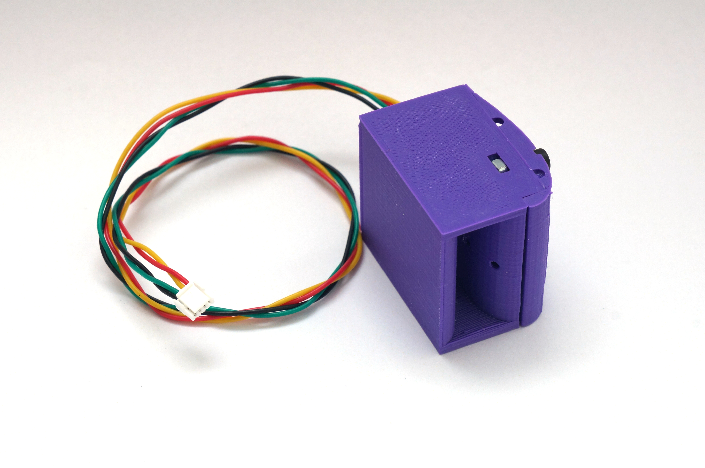

# TFSLOT01



Our [TFSLOT](https://github.com/ThunderFly-aerospace/TFSLOT01) sensor is an airspeed sensor designed to use on UAVs. Due to 3D printed case it is possible to optimize the characteristics according to the location of sensor on UAV and specific application. First use of this sensor is on ThunderFly autogyro [TF-G2](https://github.com/ThunderFly-aerospace/TF-G2/).


TFSLOT is commercially available from [ThunderFly s.r.o.](https://www.thunderfly.cz/), write an email to info@thunderfly.cz or shop at [Tindie store]().

# Advantages to pitot-static tube

In cotrast to classical [Pitot tube](https://en.wikipedia.org/wiki/Pitot_tube), the TFSLOT design is perfect choice for low airspeed measurement (generally bellow 10 m/s).
The design has following advantages compared to pitot-probe

  * Better resolution on low airspeeds
  * Less tendency to clogging
  * Direct differential pressure sensor integration without any additional tubing.

# Usage 

## PX4 autopilot
TFSLOT is equipped with [TFASPDIMU](https://github.com/ThunderFly-aerospace/TFASPDIMU01) electronics, which contains required differential pressure sensor and an IMU unit through which the pressure sensor is connected. To activate I2C access to it, it is necessary to set the pass-through mode in the IMU unit. PX4 is able to do it. All you have to do is add the following two lines to the startup configuration file on the SD card.

```
icm20948_i2c_passthrough start -X -b 2 -a 0x68
sdp3x_airspeed start -X -b 2
```

The script assumes a connection to port `I2C-2`. This can be changed with the `-b` parameter in both commands. 

This approach requires firmware with modifications from the [`tf/aspdimu`](https://github.com/ThunderFly-aerospace/PX4Firmware/tree/tf/aspdimu) branch. In the future, we expect merging with upstream. 
